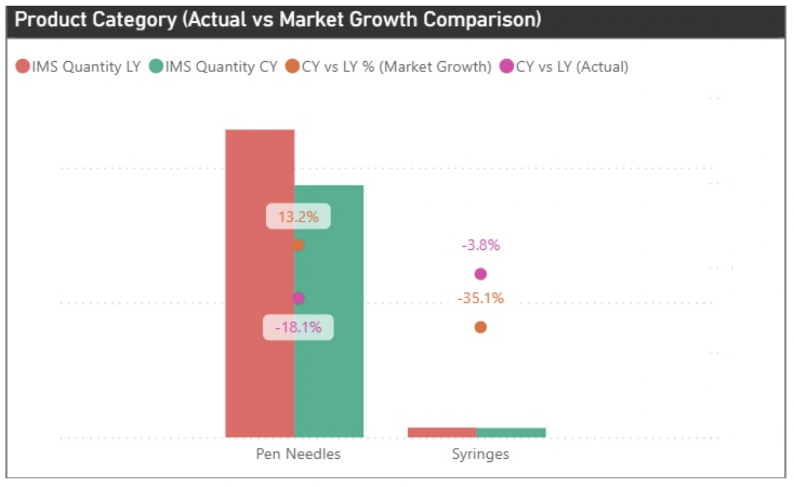
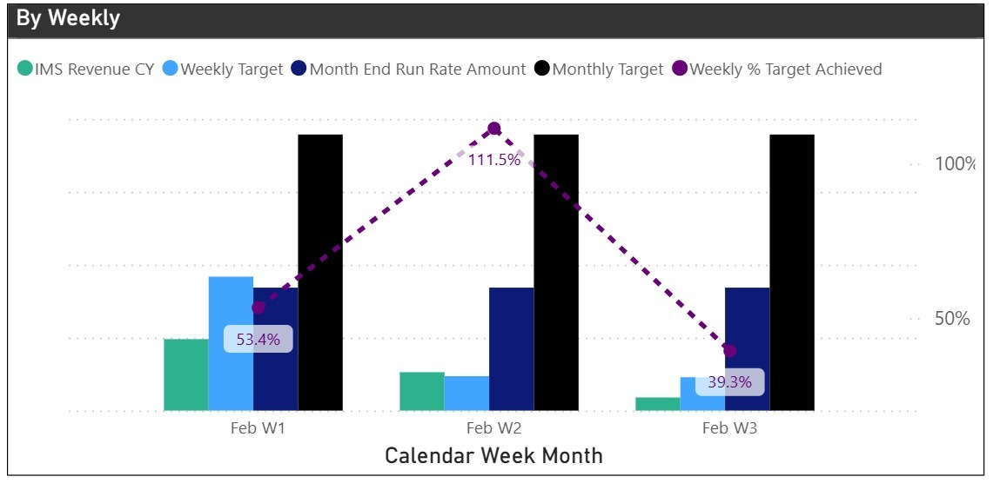
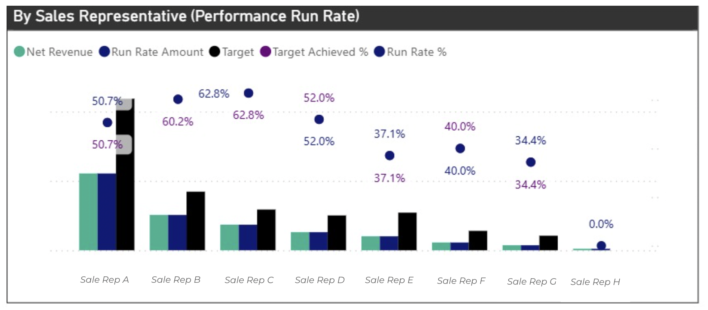
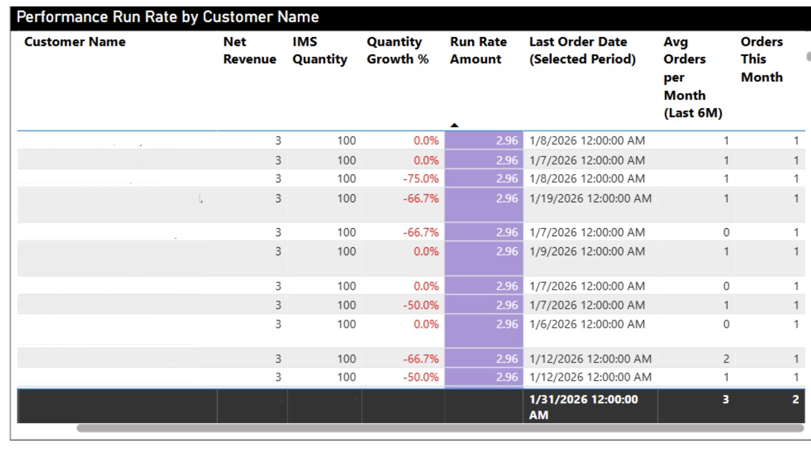
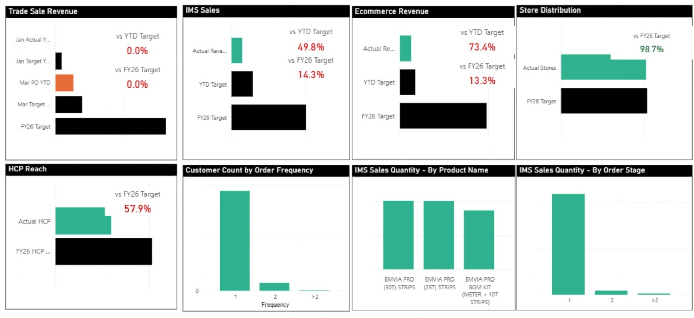

# 📊 SEA In-Market Sales (IMS) Dashboard Enhancement
### Power BI · DAX · Excel Data Pipeline | Healthcare | embecta | 2026

> Sample/anonymised data used in all screenshots. Real market data is confidential.

---

## 📌 The Problem This Solved

Before the enhancement, the regional IMS dashboard existed — but wasn't being used.

| Market | Monthly Opens | Status |
|---|---|---|
| Philippines | 124 (52%) | ✅ Active |
| Malaysia & Vietnam | 70 (30%) | ⚠️ Low |
| Singapore & Thailand | 31 (13%) | ❌ Inactive |
| Indonesia | 9 (3%) | ❌ Almost ignored |

**354 opens vs 600 expected. 50% of opens from just 5 users — 3 were not even sales staff.**

The dashboard existed, but it wasn't serving the people it was built for.
---

## 🎯 Project Objective

> Transform the IMS dashboard from a **monthly reporting tool** into a **live commercial decision engine** — one that sales teams and business leaders would open daily, not just at month-end.

The shift in purpose was fundamental:

```
BEFORE:  Monthly reporting → review what happened
AFTER:   Real-time run rate + weekly tracking → act on what's happening now
```
Three strategic pillars drove the redesign:

- **Unified Intelligence** — one source of truth replacing fragmented Excel files, distributor apps, and manual reports across 7 markets
- **Commercial Prioritisation** — run-rate projections by sales rep and customer so teams can redirect effort before month-end, not after
- **New Launch Integration** — BGM product launch campaign embedded directly into the dashboard for real-time measurement


---

## ⚙️ Technical Approach

This was not a from-scratch build. The challenge was harder in some ways — inheriting an existing report with live data dependencies and redesigning it without breaking existing workflows.

**Data architecture:**
- Source data: Excel files submitted by country teams in **7 different formats** (SG, MY, TH, VN, ID, PH, PK)
- Each market used different distributor systems — some real-time platforms, some daily Excel outputs, some weekly sub-distributor consolidations
- All files were stored in a **shared regional folder**
- DAX measures were written to **standardise, merge, and calculate** across these inconsistent inputs before any visualisation layer

**Key DAX work included:**
- Run rate calculation (annualised from MTD actuals)
- Week-on-week gap-to-target measures
- Customer status classification (New / Lost / Regained) using order history
- R12M market growth trend automation via MIDAS Dataflow integration
- Rolling 6-month average order frequency per customer
  
---

## What Was Built

### 🔹 Product Category Growth vs Market
*Is the business growing faster or slower than the market?*



> Pen Needles actual −18.1% vs market +13.2% → losing share, not just declining

---

### 🔹 Sales Rep Weekly Tracking + Run Rate
*Who needs support before month-end — not after?*



> Weekly % target tracked per rep → flag gaps and act in the same month


> **Note:** IF the reporting period has reached month-end, the **Run Rate %** is equivalent to the **Target Achieved %**. No projection methodology is applied, as calculations are based on actual finalized performance.
---

### 🔹 Account Summary *(new)*

**Added:** Customer status tracking + customer-level run rate



Two analytical layers:

**Customer Status (historical view):**
Tracks New, Lost, and Regained customers month-by-month. If lost customers consistently outnumber new and regained combined, it signals a retention problem requiring root-cause investigation — pricing, stock, service level.

**Customer Run Rate (current month):**
For each account: actual revenue, IMS quantity, quantity growth %, run rate projection, last order date, average orders per month (last 6M), and orders this month.

The combination enables a specific decision framework:
- Run rate below expectations + orders this month < 6M average + recent last order date → **push for additional sales this month**
- Quantity growth below market growth + below last year → **this account needs attention**


> Last order date + orders this month vs 6M average → tells reps exactly where to push

---

### 🔹 New Launch Dashboard (BGM)
*Campaign performance in one place — no more manual spreadsheets*



---

## Technical Work

| Layer | Detail |
|---|---|
| **Data sources** | Excel files from 7 markets in different formats — standardised via Power Query |
| **DAX measures** | Run rate · Gap-to-target · Customer status (New/Lost/Regained) · R12M market growth |
| **Access control** | Row-level security — BLs see all markets, reps see only their own data |
| **Automation** | MIDAS Dataflow integration for market growth data — removed manual updates |

---

## Views Added / Enhanced

| # | View | Type |
|---|---|---|
| 1 | Overall Sales Performance | Retained |
| 2 | Quantity + Category Growth vs Market | New |
| 3 | Sales Rep Weekly + Run Rate | **New** |
| 4 | Account Summary + Customer Run Rate | **New** |
| 5 | Cluster Summary (MBR) — automated | Enhanced |
| 6 | Overall Contribution + Product Line | Enhanced |
| 7 | New Launch Campaign (BGM) | **New** |

---

## 💡 Key Lessons

1. **A dashboard that isn't used isn't an analytics asset — it's a maintenance burden.** Adoption is a product problem, not a training problem.

2. **The biggest insight gap was time.** Monthly reporting told teams what happened. Weekly run rates tell them what to do next. That shift — from retrospective to predictive — changed how the tool was perceived.

3. **Stakeholder requirements gathering before building** saved significant rework. The features that drove adoption (rep tracking, customer run rate) came directly from sales leader interviews, not assumptions.

4. **Data standardisation across 7 markets with different formats** was the hardest part — and the least visible. Most of the DAX work was making messy, inconsistent inputs behave like a single clean dataset.


## Stack

`Power BI` · `DAX` · `Power Query (M)` · `Excel` · `MIDAS Dataflow` · `Pitcher`

---

## 🔗 More Projects

 🛒 [SQL + R Customer Survey Pipeline](https://github.com/thaotracy-sg/sql-r-customer-survey-pipeline) <br>
 📱 [Causal Analysis Using Panel Logit Model – Game App](https://github.com/thaotracy-sg/Causal-analysis-panel-logit-R-gameapp) <br>
 🌿 [Sustainable Brand Logit Analysis](https://github.com/thaotracy-sg/Sustainable-brand-logit-analysis) <br>
 🧴 [Commercial Analytics – Skincare Channel Performance](https://github.com/thaotracy-sg/Commercial-analytics-skincare-channel-performance) <br>
 🔋 [Time Series Forecasting – Electric Power & CO2 Emissions](https://github.com/thaotracy-sg/Time-series-forecasting-electric-power-co2-emission-europe) <br>

---
*Tracy Nguyen · embecta Business Support Intern · Dec 2025 – Jun 2026*
